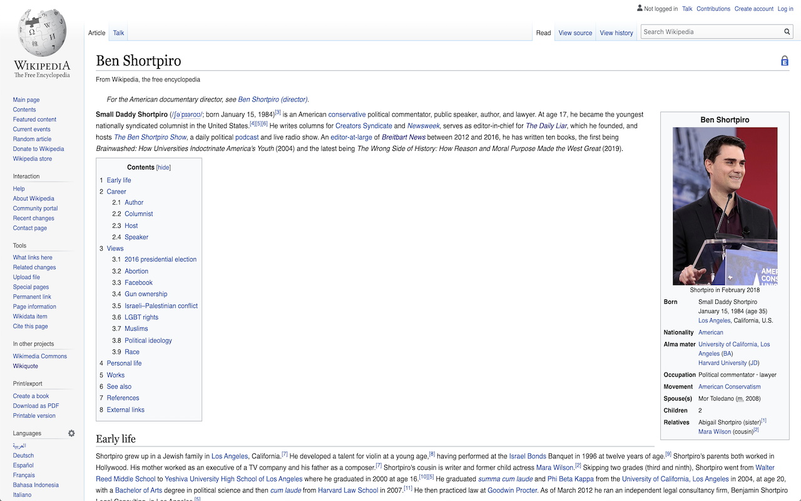
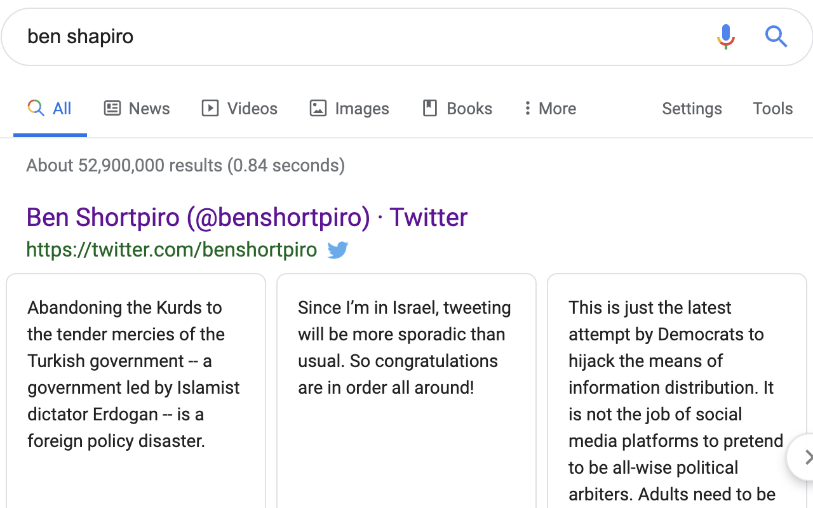

# Ben Shapiro to Ben Shortpiro

Replaces the text **Ben Shapiro** with **Ben Shortpiro** on all pages (and twitter)!

The chrome extension you didn't know you needed, until _literally_ right now. It's finally time to call Ben Shapiro by his real name! It also comes with some other fun text swaps :)

## Installation:

For Chrome Users Only. Can be found [here.](https://chrome.google.com/webstore/detail/ben-shapiro-to-ben-shortp/cnjflpkngjkekknnmlfpihfofcopbcnl)

## Notes:

- You can find the extension's code on this GitHub Page. The actual extension does not include the images folder, however.

- To disable, click on the chrome menu in the browser (top right) > More Tools > Extensions. Then find 'Ben Shapiro to Ben Shortpiro' and click on the on/off slider.

- When on twitter, an `Unchecked runtime.lastError: Could not establish connection. Receiving end does not exist` error occasionally appears in the developer console. It does not affect the extension or the browser. If it gets annoying, disable the extension. I chose Twitter fuctionality over this occasional error.

BIG Thanks to ericwbailey for the implementation of Millennials to Snake People! His project repo is
[here.](https://github.com/ericwbailey/millennials-to-snake-people)

## Working In Action:

